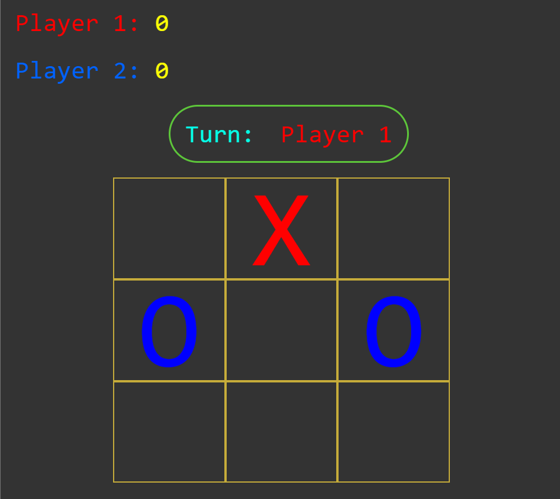

# Tic Tac Toe

  

Put three X's or O's in a row, in a column or in a diagonal to win the game.

<a href="https://kdannothere.github.io/tic-tac-toe-angular/" target="_blank">Launch the game</a>

The game was created using basics of HTML and CSS, JavaScript and some AI Tools for practice and learning Web Development. And later it was transfered to Angular framework and javascript code was rewritten in TypeScript using Copilot AI.

This project was generated with [Angular CLI](https://github.com/angular/angular-cli) version 16.2.11.
